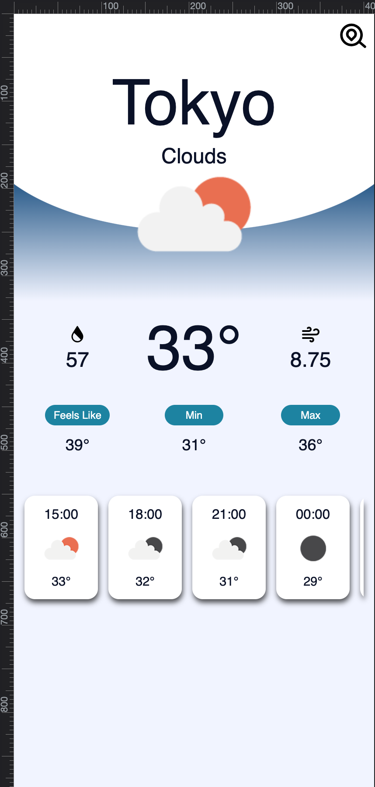

# Weather App

Install dependencies `yarn install`

Run the app `yarn run web`

# UI Design
<table>
    <tbody>
        <tr>
            <td>
            
#ffffff

            </td>
            <td rowspan=5></td>
        </tr>
        <tr>
            <td>
            
#0a1128

            </td>
        </tr>
        <tr>
            <td>
            
#034078

            </td>
        </tr>
        <tr>
            <td>
            
#1282A2

            </td>
        </tr>
        <tr>
            <td>
            
#f1f4ff

            </td>
        </tr>
    </tbody>
</table>

# OpenWeatherMap API

## Current Weather
`https://api.openweathermap.org/data/2.5/weather?q=${city}&appid={$api_key}&units=metric`

## Weather Forecast
`https://api.openweathermap.org/data/2.5/forecast?q=${city}&appid={$api_key}&units=metric`

## Weather Icons
`https://openweathermap.org/img/wn/${icon}.png`
Append @2x or @4x to icon name for higher quality image